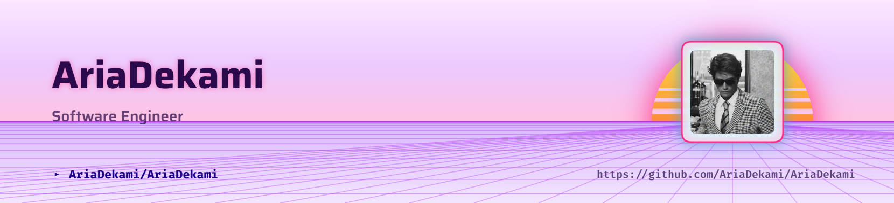

<!-- ========================================= -->
<!--          GITHUB PROFILE README            -->
<!-- ========================================= -->

<picture>
   <source media="(prefers-color-scheme: dark)" srcset="art/header-dark.png">
   
</picture>

# Well hello there, I'm **[Aria Dekami]** 👋

 

---

# 💫 About Me

<table>
<tr>

<td width="65%" valign="top">

### 👨‍💻 Hi!

I'm **[Aria Dekami]**, a passionate developer who enjoys building clean,
modern and scalable web applications.

### 🚀 Currently

- 🌱 Learning **Computer Science & Artificial Intelligence**
- ⚛️ Building projects with **React**, **Next.js**, and **TypeScript**
- 🎨 Passionate about UI/UX and premium interfaces
- 💡 Always exploring better software architecture
- 📚 Constantly improving every single day

### 🎯 Goals

- Build impactful products
- Master frontend engineering
- Learn AI & Machine Learning
- Contribute to Open Source

</td>

<td width="35%" align="center">

</td>

</tr>
</table>

---

# ⚡ Tech Stack

---

# 📊 GitHub Analytics

  

---

# 🐍 Contribution Snake

<!--
GitHub Action:
https://github.com/Platane/snk

Example output:

https://raw.githubusercontent.com/[YOUR_USERNAME]/[YOUR_USERNAME]/output/github-contribution-grid-snake-dark.svg
-->

---

# 🌐 Connect With Me

---

### ⭐ Thanks for visiting my profile!

*"Code. Learn. Build. Repeat."*

<picture>
  <source
    media="(prefers-color-scheme: dark)"
    srcset="https://capsule-render.vercel.app/api?type=waving&section=footer&height=150&color=0:0A192F,100:102A43"
  />
  <source
    media="(prefers-color-scheme: light)"
    srcset="https://capsule-render.vercel.app/api?type=waving&section=footer&height=150&color=0:EAF2FF,100:C7DAFF"
  />
  
</picture>
